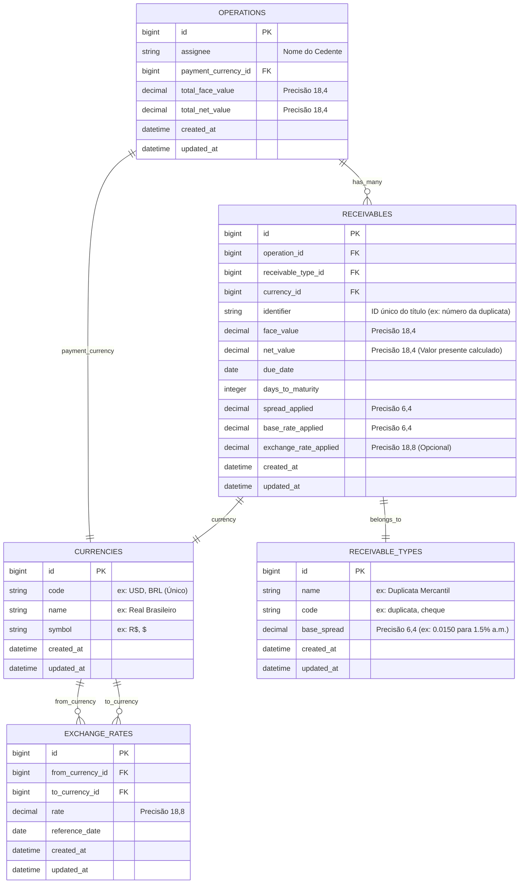

# Diagrama de Modelagem de Dados

Este arquivo contém a representação lógica da base de dados do **SRM Credit Engine**.

```mermaid
erDiagram
    CURRENCIES {
        bigint id PK
        string code "ex: USD, BRL (Único)"
        string name "ex: Real Brasileiro"
        string symbol "ex: R$, $"
        datetime created_at
        datetime updated_at
    }

    EXCHANGE_RATES {
        bigint id PK
        bigint from_currency_id FK
        bigint to_currency_id FK
        decimal rate "Precisão 18,8"
        date reference_date
        datetime created_at
        datetime updated_at
    }

    RECEIVABLE_TYPES {
        bigint id PK
        string name "ex: Duplicata Mercantil"
        string code "ex: duplicata, cheque"
        decimal base_spread "Precisão 6,4 (ex: 0.0150 para 1.5% a.m.)"
        datetime created_at
        datetime updated_at
    }

    OPERATIONS {
        bigint id PK
        string assignee "Nome do Cedente"
        bigint payment_currency_id FK
        decimal total_face_value "Precisão 18,4"
        decimal total_net_value "Precisão 18,4"
        datetime created_at
        datetime updated_at
    }

    RECEIVABLES {
        bigint id PK
        bigint operation_id FK
        bigint receivable_type_id FK
        bigint currency_id FK
        string identifier "ID único do título (ex: número da duplicata)"
        decimal face_value "Precisão 18,4"
        decimal net_value "Precisão 18,4 (Valor presente calculado)"
        date due_date
        integer days_to_maturity
        decimal spread_applied "Precisão 6,4"
        decimal base_rate_applied "Precisão 6,4"
        decimal exchange_rate_applied "Precisão 18,8 (Opcional)"
        datetime created_at
        datetime updated_at
    }

    CURRENCIES ||--o{ EXCHANGE_RATES : "from_currency"
    CURRENCIES ||--o{ EXCHANGE_RATES : "to_currency"
    OPERATIONS ||--o{ RECEIVABLES : "has_many"
    OPERATIONS ||--|| CURRENCIES : "payment_currency"
    RECEIVABLES ||--|| RECEIVABLE_TYPES : "belongs_to"
    RECEIVABLES ||--|| CURRENCIES : "currency"
```
